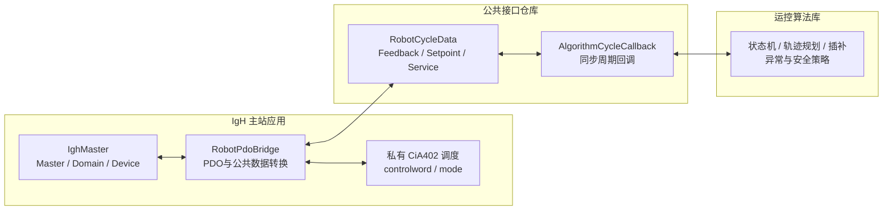
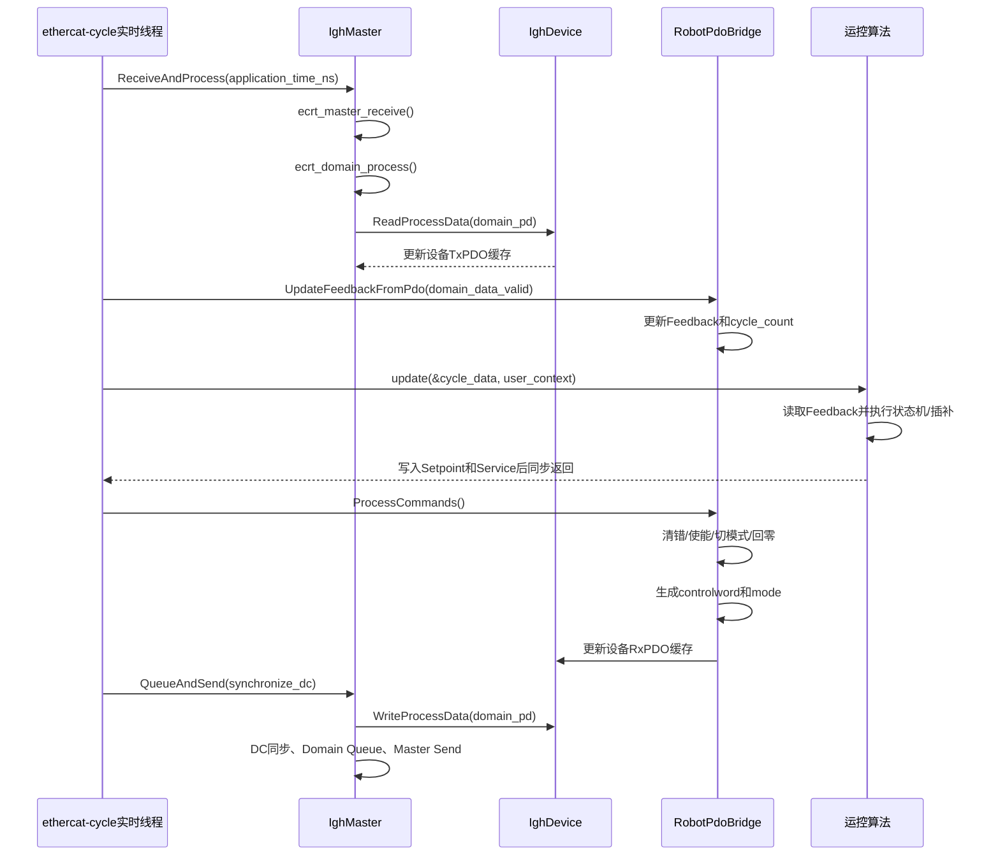

# IgH 与运控算法周期接口及调度说明

## 1. 文档目的

本文档规定 IgH EtherCAT 主站模块与运控算法之间的实时周期接口、数据
所有权、调用顺序和异常处理边界，用于指导双方后续联调。

设计目标如下：

- 运控算法只依赖公共 `robot_interface`，不依赖 IgH、CiA402、具体从站
  或 EtherCAT PDO 定义。
- IgH 与算法在同一个 EtherCAT 实时周期线程内同步调用。
- 一个周期只传递一个固定地址的 `RobotCycleData`，不复制整套业务对象。
- EtherCAT 通信异常时仍然调用算法、处理命令并继续发送 PDO。
- 通信恢复由 IgH 内核主站负责，运动安全策略由运控算法负责。
- CycloneDDS、文件、日志和其他非实时业务不得进入本接口的实时调用路径。

当前公共数据定义位于：

```text
third_party/robot_interface/include/robot_data.h
```

当前 PDO 桥接实现位于：

```text
src/orchestrator/robot_pdo_bridge.h
src/orchestrator/robot_pdo_bridge.cpp
```

当前周期编排入口位于：

```text
src/orchestrator/robot_ethercat_orchestrator.cpp
RobotEthercatOrchestrator::RunCycle()
```

## 2. 模块边界



依赖关系必须保持为：

```text
robot_interface
    ↑              ↑
IgH 主站应用       运控算法库
```

不允许形成以下依赖：

```text
运控算法库 → IgH
运控算法库 → CiA402
运控算法库 → 具体从站适配器
```

算法人员只需要知道：

- `RobotCycleData`
- `AxisFeedback`
- `AxisSetpoint`
- `RobotServiceRequest`
- `RobotMode`
- 后续增加的同步周期回调类型

## 3. 公共周期数据

IgH 与算法通过同一个 `robot_interface::RobotCycleData` 对象交换数据。

```cpp
struct RobotCycleData
{
    AxisFeedback robot_feedback[kMaxRobotAxisCount]{};
    AxisSetpoint robot_setpoints[kMaxRobotAxisCount]{};
    RobotServiceRequest service{};

    uint8_t robot_axis_count = 0;
    uint32_t cycle_time_ns = 0;
    uint64_t cycle_count = 0;
};
```

### 3.1 字段所有权

| 字段 | 写入方 | 读取方 | 说明 |
| --- | --- | --- | --- |
| `robot_feedback` | IgH | 算法 | 当前周期 TxPDO 反馈 |
| `robot_setpoints` | 算法 | IgH | 下一次 PDO 发送使用的运动目标 |
| `service` | 算法 | IgH | 使能、断使能、清错、切模式和回零请求 |
| `robot_axis_count` | IgH 初始化阶段 | 算法 | 实际参与运控的连续逻辑轴数量 |
| `cycle_time_ns` | IgH 初始化阶段 | 算法 | 标称 EtherCAT 周期 |
| `cycle_count` | IgH 每周期递增 | 算法 | 当前周期序号 |

双方不得写入不属于自己的字段。

### 3.2 逻辑轴编号

`robot_feedback[index]` 与 `robot_setpoints[index]` 使用机器人逻辑轴编号，
不使用 EtherCAT 物理位置。

逻辑轴编号必须满足：

```text
0, 1, 2, ..., robot_axis_count - 1
```

逻辑轴与具体从站的绑定在 `DeviceSetup` 中完成。算法不需要知道从站
Alias、Position、Vendor ID 或 Product Code。

### 3.3 数据单位

当前公共结构使用整数数据，具体单位必须由机器人整机配置统一规定，例如：

- 位置：编码器计数或统一缩放后的关节位置。
- 速度：驱动器单位或统一缩放后的关节速度。
- 转矩：驱动器额定转矩比例或统一工程单位。

IgH 和算法必须使用同一套缩放约定。单位和缩放未确定前，不应默认把整数
解释为弧度、弧度每秒或牛米。

## 4. 建议增加的算法周期接口

当前 `RunCycle()` 已预留算法同步回调位置，但尚未真正接入算法函数。建议在
公共接口头文件中增加以下形式：

```cpp
namespace robot_interface
{

using AlgorithmCycleCallback =
    void (*)(RobotCycleData* cycle_data, void* user_context) noexcept;

struct AlgorithmCycleInterface
{
    AlgorithmCycleCallback update = nullptr;
    void* user_context = nullptr;
};

} // namespace robot_interface
```

接口含义：

- `update`：运控算法提供的同步单周期函数。
- `cycle_data`：IgH 内部长期持有的公共周期数据指针。
- `user_context`：算法实例或算法上下文，由算法创建和解释。
- `noexcept`：周期函数不得抛出异常。

使用函数指针和上下文指针的原因：

- 不要求算法公开具体类定义。
- 不要求算法依赖编排层头文件。
- 回调阶段不需要动态分配内存。
- 可以连接 C 风格接口、C++ 对象或动态库导出接口。
- 避免 IgH 与算法之间产生循环依赖。

算法侧可以使用一个适配函数连接自己的类：

```cpp
class MotionController
{
public:
    void Update(robot_interface::RobotCycleData& cycle_data) noexcept;
};

void RunMotionAlgorithm(robot_interface::RobotCycleData* cycle_data,
                        void* user_context) noexcept
{
    if (!cycle_data || !user_context)
    {
        return;
    }

    auto* controller = static_cast<MotionController*>(user_context);
    controller->Update(*cycle_data);
}
```

主站应用装配时只保存接口，不需要知道 `MotionController` 的内部实现：

```cpp
MotionController motion_controller;

robot_interface::AlgorithmCycleInterface algorithm{
    &RunMotionAlgorithm,
    &motion_controller,
};
```

最终建议由 `RobotEthercatOrchestrator` 构造函数接收该接口。初始化时应拒绝
空回调，运行期间不得替换回调或上下文。

## 5. 单周期固定调度顺序

算法回调必须在读取完全部 TxPDO 之后、生成 CiA402 命令和写入 RxPDO
之前执行。



对应 `RunCycle()` 的目标结构为：

```cpp
OrchestratorResult RobotEthercatOrchestrator::RunCycle(
    uint64_t application_time_ns)
{
    master_->ReceiveAndProcess(application_time_ns);

    pdo_bridge_->UpdateFeedbackFromPdo(
        master_->domain_data_valid());

    algorithm_.update(
        &pdo_bridge_->cycle_data(),
        algorithm_.user_context);

    pdo_bridge_->ProcessCommands();

    master_->QueueAndSend(configuration_.synchronize_dc);
    return OrchestratorResult::kSuccess;
}
```

一次 `RunCycle()` 只调用一次算法函数。算法回调不会并发调用，也不会重入。

## 6. 算法对反馈的处理要求

算法每周期首先检查：

```cpp
cycle_data.robot_axis_count
cycle_data.cycle_count
cycle_data.robot_feedback[index].communication_valid
```

当 `communication_valid != 0` 时，本周期反馈同时满足：

- Domain Working Counter 完整。
- 对应已配置从站在线并进入 OP。

当 `communication_valid == 0` 时：

- `actual_position`、`actual_velocity`、`actual_torque` 等字段不保证是本周期
  新数据。
- 算法不得把这些数值当作有效的新反馈推进正常轨迹。
- 算法必须按照自身安全策略决定保持、减速、停止或撤销任务。
- IgH 不会替算法选择目标位置，也不会擅自把目标位置改为实际位置。

即使通信异常，IgH 仍会：

```text
读取PDO缓存
→ 更新communication_valid
→ 调用算法
→ 处理算法命令
→ 写入PDO缓存
→ 继续发送EtherCAT帧
```

## 7. 算法输出要求

### 7.1 运动目标

算法在每个有效周期中更新：

```cpp
robot_setpoints[index].target_position
robot_setpoints[index].target_velocity
robot_setpoints[index].target_torque
```

IgH 不判断哪一个目标字段与当前模式匹配，只负责映射到标准 RxPDO。算法应
根据当前运行模式输出一致的数据。

### 7.2 服务请求

服务请求不是互斥枚举，多个请求允许在同一周期同时存在：

```cpp
cycle_data.service.clear_error = 1;
cycle_data.service.power_request_valid = 1;
cycle_data.service.power_enable = 1;
cycle_data.service.switch_mode = 1;
cycle_data.service.target_mode = robot_interface::RobotMode::kCsp;
```

IgH 内部固定处理顺序为：

```text
清错 → 使能/断使能 → 切换模式 → 回零
```

各字段当前语义如下：

| 字段 | 当前调度语义 |
| --- | --- |
| `clear_error` | 每周期传给清错状态机；算法按策略保持或撤销 |
| `power_request_valid` | 表示本周期 `power_enable` 是否提供新的有效请求 |
| `power_enable` | `1` 请求使能，`0` 请求断使能 |
| `switch_mode` | `1` 时执行模式切换状态机 |
| `target_mode` | 目标 CSP、CSV、CST 或 Homing 模式 |
| `home` | 每周期传给回零状态机；算法按回零流程保持或撤销 |

算法应根据反馈判断跨周期动作是否完成：

- 使能结果：`feedback.enabled`
- 模式切换结果：`feedback.active_mode`
- 故障结果：`feedback.error_code`
- 通信状态：`feedback.communication_valid`

单次函数调用成功只表示本周期状态机正常执行，不代表使能、模式切换或回零
已经在一个周期内完成。

当前 `AxisFeedback` 尚未提供回零完成和回零失败状态。正式接入 Homing 前，
需要在公共接口中补充类似字段：

```cpp
uint8_t homing_attained = 0;
uint8_t homing_error = 0;
```

由 IgH 根据驱动器模式相关状态位生成，算法据此结束或中止跨周期回零流程。
不得仅通过等待固定周期数判断回零完成。

## 8. 数据生命周期和线程安全

`RobotCycleData` 由 `RobotPdoBridge` 独占创建和保存：

- 初始化完成后地址保持稳定。
- IgH 在调用算法前写 Feedback。
- 算法同步写 Setpoint 和 Service。
- 算法返回后 IgH 才读取这些输出。
- 整个过程发生在同一个 `ethercat-cycle` 线程中。

因此实时周期内不需要为 `RobotCycleData` 加锁。

算法不得：

- 在其他线程同时读写该指针。
- 保存该指针并在回调返回后异步修改。
- 把该指针直接交给 CycloneDDS 线程。

如果主控软件或 CycloneDDS 需要机器人状态，应由算法或业务适配层把所需
字段复制到预分配的双缓冲或无锁队列。网络线程只访问快照，不访问实时周期
中的原始 `RobotCycleData`。

## 9. 实时回调限制

算法周期函数运行在 `ethercat-cycle` 实时线程中，必须满足：

- 不进行动态内存分配和释放。
- 不使用可能阻塞的互斥锁、条件变量或信号量。
- 不进行文件读写、终端打印或日志格式化。
- 不调用 CycloneDDS、Socket 或其他网络接口。
- 不执行 SDO、FoE、CoE mailbox 等阻塞通信。
- 不调用 `sleep`。
- 不创建、销毁线程。
- 不抛出异常。
- 不调用执行时间不可控的外部接口。

算法最坏执行时间必须小于：

```text
EtherCAT周期
- EtherCAT收发和Domain处理时间
- PDO桥接时间
- DC同步与发送时间
- 必要的实时裕量
```

当前周期为 1 ms，因此算法不能仅满足“平均执行时间小于 1 ms”，而应验证
最坏执行时间和周期抖动。

## 10. 异常处理职责

### 10.1 IgH 主站负责

- 维持 EtherCAT 周期收发。
- 更新每轴 `communication_valid`。
- 把有效或无效的当前反馈照常交给算法。
- 把算法给出的命令照常转换并写入 PDO。
- 通过 IgH 内核状态机等待链路恢复、重新扫描和重新配置从站。
- 通信恢复后继续更新状态和 PDO。

### 10.2 运控算法负责

- 根据 `communication_valid` 判断反馈能否参与控制计算。
- 决定通信异常时保持、减速、停止还是进入其他安全状态。
- 清除或保留运动任务、轨迹和服务请求。
- 通信恢复后决定是否重新使能、重新规划以及是否需要人工确认。
- 确保异常期间输出仍然确定，不能依赖未初始化数据。

### 10.3 IgH 主站不得擅自执行

- 因通信异常停止调用算法。
- 因通信异常停止 PDO 发送。
- 自动锁存实际位置并覆盖算法目标。
- 自动清除算法轨迹。
- 自动决定断使能或重新使能。
- 自动决定通信恢复后是否继续原任务。

## 11. 生命周期建议

建议整体启动顺序：

```text
1. 创建算法上下文
2. 完成算法非实时初始化
3. 构造AlgorithmCycleInterface
4. 构造RobotEthercatOrchestrator
5. 注册并配置全部EtherCAT设备
6. 激活IgH Master和Domain
7. 配置RobotPdoBridge
8. 启动唯一ethercat-cycle线程
9. 每1 ms同步调用算法周期函数
```

建议停止顺序：

```text
1. 通知实时周期线程退出
2. 等待ethercat-cycle线程结束
3. 释放RobotPdoBridge
4. 释放IghMaster、Domain和设备配置
5. 执行算法非实时Shutdown
6. 销毁算法上下文
```

不得在算法上下文已经销毁后继续调用周期回调。

## 12. 当前实现状态

已经完成：

- `RobotCycleData` 公共结构。
- 逻辑轴与具体 PDO 设备绑定。
- TxPDO 到 `AxisFeedback` 的映射。
- `communication_valid` 和 `enabled` 的生成。
- 算法 Setpoint 到 RxPDO 的映射。
- 清错、使能、切模式和回零的多轴 CiA402 调度。
- 多类服务请求在同一周期独立执行。
- 通信异常时继续 PDO 收发的主站行为。
- `RunCycle()` 中算法同步回调位置预留。

尚未完成：

- 在公共接口中增加 `AlgorithmCycleCallback` 和
  `AlgorithmCycleInterface`。
- 由 `RobotEthercatOrchestrator` 接收并保存算法接口。
- 在 `RunCycle()` 的预留位置真正调用算法。
- 增加算法空指针、生命周期和周期执行时间检查。
- 与算法团队共同确定位置、速度和转矩单位。
- 补充回零完成和回零失败反馈。
- 根据最终算法接口完成实时周期联调和超时测试。

## 13. 联调验收条件

接口联调至少验证以下项目：

1. 算法每个 EtherCAT 周期只被调用一次。
2. 算法看到的 `cycle_count` 连续递增。
3. 算法调用前已经完成当前周期 Feedback 更新。
4. 算法返回后，其 Setpoint 在同一周期写入 RxPDO。
5. 多个 Service 字段同时置位时不会互相覆盖。
6. 从站退出 OP 后算法仍继续被调用。
7. 通信异常时对应轴 `communication_valid` 变为 0。
8. 通信恢复后 `communication_valid` 自动恢复为 1。
9. IgH 不会因通信异常擅自覆盖算法命令。
10. 算法执行时间和整个 EtherCAT 周期满足 1 ms 最坏时延要求。
11. CycloneDDS 或其他非实时线程不会直接访问 `RobotCycleData`。
12. 停机时先停止周期线程，再销毁算法上下文和 EtherCAT 资源。
